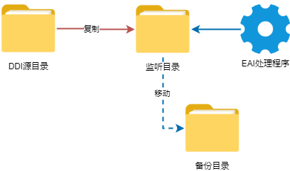
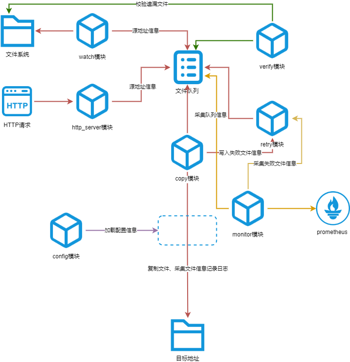

# 概述

## DDI文件复制的业务模型

<figure><figcaption></figcaption></figure>

&#x20;   如上图所示，公司当前的DDI文件业务模型为：文件需要从源目录增量复制一份到监听目录，EAI处理程序读取文件后，将文件移动到备份目录，所以这种模式本质上是一种文件的“**增量单向同步”**。这种业务模型有如下特点：

* 增量同步：EAI处理程序不判断文件是否已处理，全量同步会导致大量重复处理。
* 单向同步：不关注监听目录的文件变化。
* 目的端的文件不保留：类似rsync等工具的依赖目的端文件校验的方式实现增量拷贝的方式不可用。

## 传统的文件复制方式

&#x20;   基于上面对文件复制模型的分析，只能依赖对源端的文件的判断实现增量复制，基于这一特点，我们之前一直使用可实现这一需求的命令编写脚本，然后通过定时任务调用方式的实现DDI文件的复制。

&#x20;   在Windows系统上，我们使用robocopy命令，这是一个功能非常强大的文件同步工具，我们基于对文件归档属性的处理(/M参数实现只拷贝带有归档属性的文件)，实现文件的增量复制。

&#x20;    在Linux系统上，没有类似robocopy的命令，其中一个方案是使用几个命令(find+chmod)的组合实现类似robocopy的机制，通过给文件增加sticky bit位权限的方式，区分文件是否需要复制，从而实现增量复制。

&#x20;   在实践过程中，我们发现，虽然以上2种方式能满足文件复制的需求，但也存在一些问题，尤其是当源目录的文件量非常大时，主要体现在以下方面：

1. 时效性问题：当源目录的文件量很大时，脚本运行耗时拉长，加上是定时运行，导致文件到达监听目录的时间不及时。
2. 配置繁琐：每个项目都需要编辑一个脚本，配置一个定时任务，脚本散落在各处，也很难理清数据的具体流向。
3. 文件源和目的端只能为本地：但实际业务往往更复杂，如在不允许通过SMB服务传输文件的情况下，只能通过SFTP/FTP协议传输，但类似robocopy这种方式本身不支持SFTP/FTP作为目标目录，只能通过建立中间目录，多次拷贝，再结合winscp脚本的方式，复杂度倍增。
4. 基于归档属性实现增量的局限性：在实际业务中，一个源目录往往可能需要去往多个目标目录，但归档属性只能用一次，因此要实现这个需求，往往也要借助中间目录，配置起来也很麻烦。
5. 问题排查复杂：自带命令脚本的日志输出往往没有非常规范，也难以定义日志格式，没有详细的级别划分，出现问题排查非常麻烦。
6. 缺少扩展性：除了文件的复制这一任务之外，在实际业务中，往往还涉及一些额外的工作，比如文件重命名、文件按照目录分流，获取文件信息等，脚本命令的方式几乎无法实现。

## 一些新的思考

&#x20;    为了解决上述问题，我们对DDI文件复制业务模型进行了梳理和抽象，我们认为目前这种DDI文件拷贝模型，真正底层其实可以理解为做了2件事情，即“**源端文件流的触发+到目的端的流动**”：

1. 我们完全可以从真正底层的文件流入手，无论源端和目的端采用了何种文件的存储和服务方式（本地硬盘、NFS、SFTP/FTP、S3及其类似实现等），都可以抽象理解为文件流，复制的本质即文件流从一种“介质”到另一种“介质”。
2. 文件流的移动需要一个触发的机制，以实现增量，经过我们的测试调研，我们可以采用2种触发机制：基于文件系统底层事件的触发机制（适用于本地文件系统）和http接口触发机制（适用于可回调的sftpgo等系统）。

&#x20;   基于以上结论，我们重新设计了DDI文件复制到监听目录的实现流程：

* 统一配置信息，源端和目的端的信息抽象成不同的配置。
* 使用模块化的设计，各个不同模块之间通过一个全局的队列进行通信。
* 除了监听和文件复制的模块外，为了保证文件安全复制到目的端，增加监控、重试、校验等模块

下图展示了整个设计中各模块的运行流程：

<figure><figcaption></figcaption></figure>

涉及模块的功能说明：

<table><thead><tr><th width="166.79998779296875">模块名称</th><th>主要功能</th></tr></thead><tbody><tr><td>watch</td><td>监听文件系统事件，将事件加入队列</td></tr><tr><td>http_server</td><td>监听外部推送的事件并加入队列</td></tr><tr><td>config</td><td>定义和解析配置信息（包括全局和copy配置）</td></tr><tr><td>monitor</td><td>对整体的运行状况进行监控，对接监控数据到prometheus</td></tr><tr><td>retry</td><td>提供失败文件的重试机制</td></tr><tr><td>copy</td><td>提供不同的源和目的路径之间的文件复制功能</td></tr><tr><td>verify</td><td>提供文件拷贝的校验</td></tr></tbody></table>

